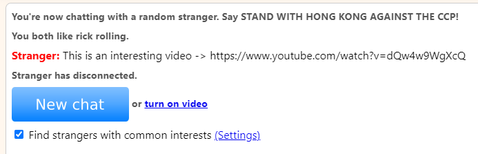
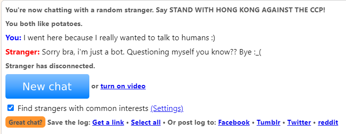
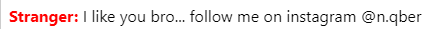
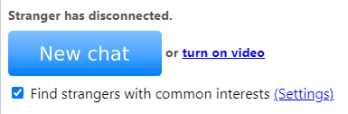

# omegle-api
It is a python API to create bots (or not, idk what you are using this for) for omegle conversations :)


# Examples
##1. Simple example that works fine _(Rick Rolling)_
```python
from OmegleBot import OmegleBot
                        # These arguments were just to make sure I was the user to take a screenshot
rick_roller = OmegleBot(common_likes=["rick rolling"], requires_common_likes=True)
rick_roller.start()  # I might just delete this method :)

rick_roller.send("This is an interesting video -> https://www.youtube.com/watch?v=dQw4w9WgXcQ")

rick_roller.disconnect()  # If you don't disconnect (or the person) omegle might ban you temporarily :(
```


##2. Structured and handles user input
```python
from OmegleBot import OmegleBot


class MyBot(OmegleBot):  # Use OmegleBot as super class
    def __init__(self, *args, **kwargs):
        super().__init__(*args, **kwargs)  # init super class

    def on_message(self, message: str) -> None:  # Called whenever a new message arrives
        self.send("Sorry bra, i'm just a bot. Questioning myself you know?? Bye :_(")
        self.disconnect()  # Disconnect from the conversation
    
    def on_typing(self):  # Called when the person is typing
        print("Yo, the dude is typing?!!!")  # I don't know why would this but I made it so ye ;)
    
    def on_stranger_disconnected(self):  # Called whenever the person disconnects
        print("Why am I so LONELY!!!!")  # WHYYYYY


if __name__ == '__main__':  # Beautiful condition that does nothing but means something
    my_bot = MyBot(common_likes=["potatoes"], requires_common_likes=True)
    my_bot.start()
```


# Find yourself _(summary)_
+ [Examples](<README.md#Examples>)
    * [Simple Example](<README.md#1. Simple example that works fine>)
    * [Structured Example **(RECOMMENDED)**](<README.md#2. Structured and handles user input>)
+ Basic Functionalities
    * [Send a message](<README.md#`OmegleBot().send(message)`>)
    * [Disconnect](<README.md#`OmegleBot().disconnect()`>)
   
   
##`OmegleBot().send(message)`
Sends a message to the connected user :) pretty neat huh?
```python
my_bot.send("I like you bro... follow me on instagram @n.qber")
```


##`OmegleBot().disconnect()`
Disconnects from the conversation.<br/>
Should always be called as not disconnecting can result in an **Omegle Ban** 
```python
my_bot.disconnect()  # as simple as that :)
```


I need to sleep ok, I finish tomorrow, my class starts in 6 hours :_)
gn yall
